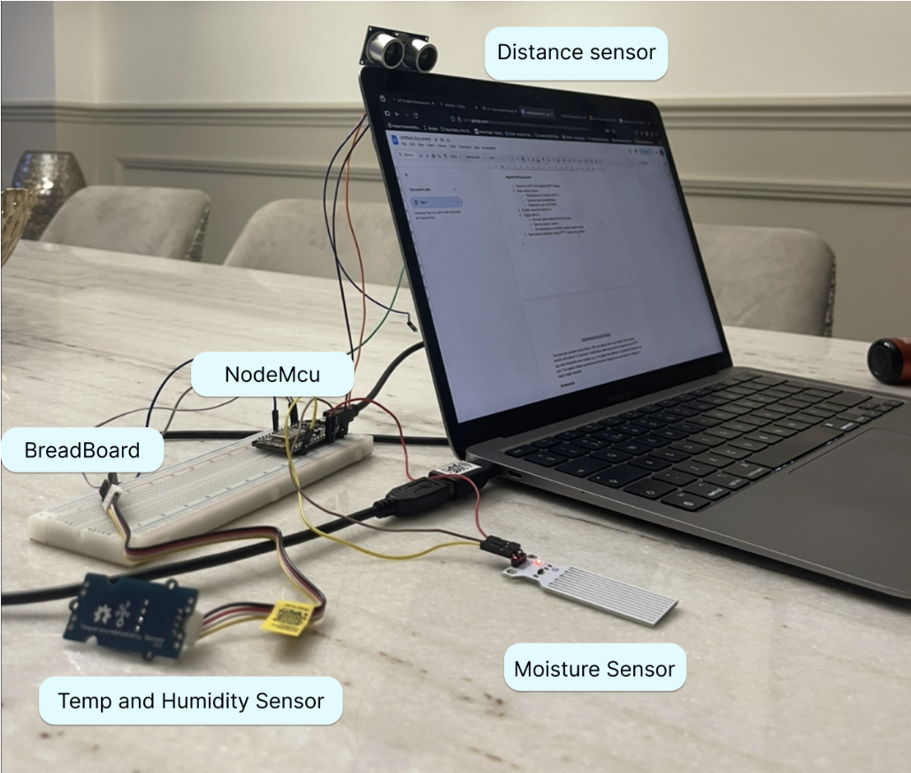
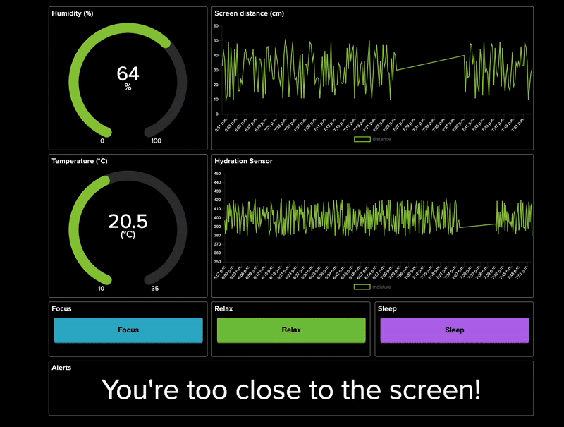

# Desk Health IoT Assistant 

An IoT project to encourage healthier desk habits — reminding you to drink water, maintain good posture, and monitor air comfort.  

---
## Project Gallery

### Physical Prototype


### Live Dashboard (Adafruit IO)


---

## Overview
Following the shift to remote work and study, people often spend hours at their desks without breaks.  
This project uses sensors + MQTT + Adafruit IO to provide real-time feedback on hydration, posture, and air comfort.
It includes both a physical prototype built with NodeMCU and sensors, and a Python-based simulator, allowing full testing 
and visualization without hardware.

- **NodeMCU ESP8266** for WiFi + MQTT communication
- **DHT11 sensor** → Temperature & Humidity  
- **Moisture sensor** → Detects presence of a water glass  
- **Ultrasonic distance sensor** → Monitors screen distance  
- **Adafruit IO** → Dashboard, controls, and alerts
  
---

##  Features
- Real-time sensor data streaming to Adafruit IO  
- Adjustable **Modes** — Focus, Relax, Sleep — that change sensitivity  
- Smart alerts for hydration, posture, and air comfort  
- Python simulator for offline testing  
- Expandable and mobile-notification ready
  
---

##  Hardware Setup
- **NodeMCU ESP8266**  
- **Breadboard**  
- **DHT11 Temp/Humidity Sensor**  
- **Soil Moisture Sensor** (used for water detection)  
- **HC-SR04 Ultrasonic Distance Sensor**  

---

## How to Run
1. Clone this repo:
   ```bash
   git clone https://github.com/yourusername/desk-health-assistant.git
   cd desk-health-assistant

    Add your Adafruit IO credentials in secrets.h (Arduino) or export them as env variables for the Python simulator.

    Run the Python simulator:

    cd Simulators/py
    source venv/bin/activate
    python desk_health_sim.py

    Or upload the Arduino code to NodeMCU.

## Future Improvements

- Add mobile notifications via IFTTT
- Include CO₂ / air quality sensor for better comfort tracking
- Create a mobile companion app
- Integrate data logging and analysis over time


## Author

Krystyna Wells - 
Computer Science student passionate about IoT, automation, and human-centered tech.
